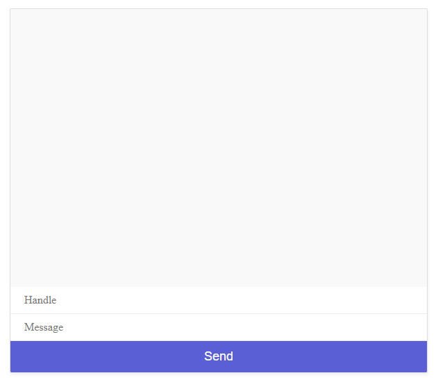

# chitter-chatter

A basic chat app using socket.io

This app was built following the tutorial series linked below. This gives a good introduction into socket.io.

[Tutorial Series](https://www.youtube.com/playlist?list=PL4cUxeGkcC9i4V-_ZVwLmOusj8YAUhj_9)

## Built With

[Socket.io](https://github.com/socketio/socket.io)
[Express](https://github.com/expressjs/express)
